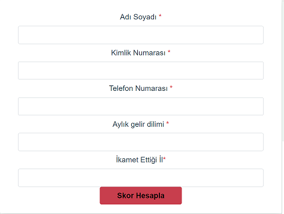
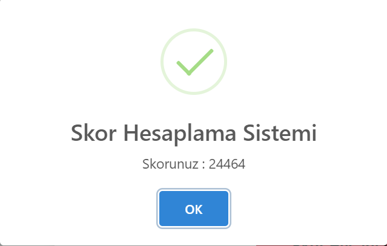

## Proje Gereksinimleri

<div style="margin:50px">
    
    
    
    
    
    
</div>

## Kurulum
<hr/>

### Kullanıcı Arayüzü Kurulum
Kullanıcı arayüzünün çalıştırılabilmesi için ekteki scriptlerin sırasıyla çalıştırılması yeterlidir.
```
cd ScoreCalculation/web
```
```
npm install
```
```
npm run serve
```
### Backend Kurulum
Backend servislerinin çalıştırılabilmesi için ekteki scriptlerin sırasıyla çalıştırılması yeterlidir.
```
cd ScoreCalculation
```
```
mvn clean install
```
```
mvn clan install (Maven kurulu değilse yukarıdaki script yerine bu script çalıştırılmalıdır)
```
```
mvn spring-boot:run
```
```
mvnw spring-boot:run (Maven kurulu değilse yukarıdaki script yerine bu script çalıştırılmalıdır)
```
### Veri tabanı kurulumu
```
cd ScoreCalculation
```
```
docker-compose up -d
```

Yukarıdaki adımlar tamamlandıktan sonra arayüze aşağoıdaki adresten erişilebilir.
* http://localhost:8080/

MongoDB veritabanı sunucu port bilgileri  aşağıdaki gibidir.
* localhost:27017

## Skor Hesaplama Kullanıcı Arayüzü
<hr/>


## Skor Hesaplama Sonucu
<hr/>


### Müşteri Skor Hesaplama Backend Servis Testi

* Method : POST
* URL: localhost:8081/insert-score
* Body : 
```
{
    "fullName": "Hasan Bilgin",
    "identityNo": "11111111111",
    "phoneNumber": "2222222222",
    "incomeTranche": "2000",
    "city": "34"
}
```
